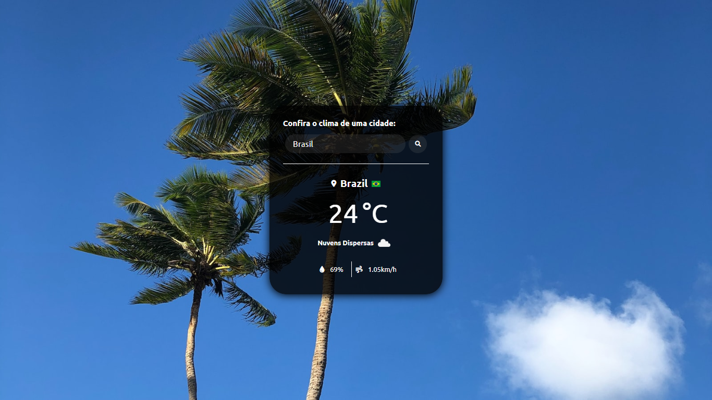

<h1 align="center"> Clima no Mundo #01 </h1>

Este é um projeto sobre Clima no Mundo

  <a href="#-tecnologias">Tecnologias</a>&nbsp;&nbsp;&nbsp;|&nbsp;&nbsp;&nbsp;
  <a href="#-projeto">Projeto</a>&nbsp;&nbsp;&nbsp;|&nbsp;&nbsp;&nbsp;
  <a href="#-layout">Layout</a>&nbsp;&nbsp;&nbsp;|&nbsp;&nbsp;&nbsp;
  <a href="#memo-licença">Licença</a>

  

 

Imagem

  

Vídeo

  https://youtu.be/-kjTj2uuB3c

 

## 🚀 Tecnologias

Esse projeto foi desenvolvido com as seguintes tecnologias:

- HTML, CSS 
- JavaScript (DOM)
- API's

## 💻 Projeto

O WheaterToday é um projeto que simula o clima de um Estado e País em tempo real, onde é possível adicionar qualquer lugar do mundo!

## 🔖 Layout 

Você pode visualizar o layout do projeto através [DESSE LINK](). 

## Licença

Esse projeto está sob a licença VAS.

---

Feito com ♥ by Vinícius de Souza (https://www.linkedin.com/in/viniciusalves254/)